# YouTube Shorts Automation Engine — Architecture & Cahier de Charge

**Version:** 2.0 (post-audit refactor)
**Date:** 2026-08-12
**Rating: 7.2 / 10**

---

## 1. Executive Summary

An automated, self-improving short-form video production system for multiple YouTube channels. The engine generates faceless vertical videos (9:16, 45–60s) from a topic name through a fully automated pipeline: script → TTS → captions → AI images → video composition → journal logging → curiosity graph. A Bayesian learning loop measures creative variable performance against real YouTube analytics and updates production decisions over time.

---

## 2. System Architecture

```mermaid
graph TD
    subgraph Entry Points
        CLI[batch_generate.py\nCLI --channel critter]
        RUN[run.py\nUnified CLI dispatcher]
    end

    subgraph Production Pipeline
        BATCH[generate_video\nbatch orchestrator]
        GS[generate_short.py\nasync core compositor]
        TTS[tts.py\nEdge-TTS free voice]
        CAP[captions.py\nfaster-whisper word-level]
        IMG[image_providers.py\nPollinations / flux chain]
        BG[background.py\nPexels → Pixabay → Pollinations]
        REV[reveal_images.py\nWikimedia Commons keyless]
        COMP[MoviePy compositor\nsplit-screen + captions + reveal]
    end

    subgraph Content Definition
        BDEF[batch_generate.py\nCRITTER_VIDEOS 33 topics\nFOLKS_VIDEOS 26 topics\nSIGMA / VERSUS / MONEY]
        ASSETS[assets/\nsubway_surfers.mp4\ngta_parkour.mp4]
    end

    subgraph Output
        OUT[output/critter/\noutput/folks/\noutput/attention/\noutput/sigma/\noutput/versus/\noutput/money/]
    end

    subgraph Data Layer
        JDB[data/youtube_journal.db\nchannels + videos ops log]
        CDB[data/curiosity.db\nknowledge graph + beliefs\n+ experiments + signals]
        BRIDGE[journal.link_to_curiosity\ncross-reference bridge]
    end

    subgraph Learning System
        GRAPH[curiosity/graph.py\nGraphStore knowledge graph]
        BELIEFS[curiosity/beliefs.py\nBayesian Beta/Linear store]
        SCHED[curiosity/scheduler.py\nexperiment designer]
        GATE[curiosity/gate.py\nadopt / test / drop]
        LOOP[curiosity/loop.py\nautonomous heartbeat]
        INGEST[curiosity/ingest.py\nYT Studio CSV + API]
        ANALYST[curiosity/analyst.py\nLLM claim proposer]
        INTEL[curiosity/intel.py\ncompetitor RSS intel]
        FEAT[curiosity/features.py\nfeature extractor]
        PREDICT[curiosity/predict.py\nOLS outcome predictor]
        POLICY[curiosity/policy.py\ngate thresholds]
    end

    subgraph Director Engine
        DIR[director/director_engine.py\nDirectorPlanner scene specs]
        COACH[director/director_coach.py\nstoryboard auditor]
        WS[director/world_state.py\nGlobalStyleBible + EpisodeWorld]
        PT[director/prompt_translator.py\nspec → prompt string]
    end

    subgraph Dashboard
        DASH[dashboard.py\nStreamlit empire overview]
    end

    CLI --> BATCH
    RUN --> BATCH
    RUN --> LOOP
    RUN --> INGEST
    BATCH --> GS
    BDEF --> BATCH
    ASSETS --> BATCH
    GS --> TTS
    GS --> CAP
    GS --> IMG
    GS --> BG
    GS --> REV
    GS --> COMP
    COMP --> OUT
    GS -->|record=True| GRAPH
    BATCH -->|log_video| JDB
    BATCH -->|link_to_curiosity| BRIDGE
    BRIDGE --> CDB
    GRAPH --> CDB
    BELIEFS --> CDB
    FEAT --> GRAPH
    INGEST --> GRAPH
    LOOP --> SCHED
    LOOP --> BELIEFS
    SCHED --> GATE
    GATE --> POLICY
    ANALYST --> BELIEFS
    INTEL --> GRAPH
    PREDICT --> GRAPH
    DIR -.->|optional| GS
    JDB --> DASH
```



---

## 3. Component Inventory

### 3.1 Production Pipeline (load-bearing)

| File | Role | Quality |
|------|------|:-------:|
| `generate_short.py` | Core async compositor — TTS → Whisper → images → MoviePy → MP4 | 7/10 |
| `batch_generate.py` | Channel orchestrator + all video definitions | 6/10 |
| `app/audio/tts.py` | Edge-TTS wrapper (free, no API key) | 7/10 |
| `app/video/captions.py` | faster-whisper word-level caption generator | 7/10 |
| `app/video/background.py` | Stock video router: Pexels → Pixabay → Pollinations | 7/10 |
| `app/video/image_providers.py` | AI image chain: Pollinations flux/turbo | 7/10 |
| `app/video/reveal_images.py` | Wikimedia Commons real-animal reveal photo | 7/10 |
| `app/video/ui_graphics.py` | PIL scene renderer for Folks channel (20 variants) | 8/10 |
| `journal.py` | Ops journal SQLite CRUD + curiosity bridge | 6/10 |

### 3.2 Learning System (functional, needs real data)

| File | Role | Quality |
|------|------|:-------:|
| `curiosity/schema.py` | SQLite DDL — nodes, edges, beliefs, experiments | 9/10 |
| `curiosity/graph.py` | Knowledge graph CRUD + video/outcome recording | 7/10 |
| `curiosity/beliefs.py` | Beta-binomial + linear Bayesian belief store | 8/10 |
| `curiosity/gate.py` | Adopt / test / drop decision engine | 8/10 |
| `curiosity/scheduler.py` | Experiment design from belief uncertainty | 7/10 |
| `curiosity/loop.py` | Autonomous learning heartbeat | 7/10 |
| `curiosity/ingest.py` | YouTube Studio CSV + Data API v3 ingestion | 8/10 |
| `curiosity/features.py` | Feature vector extraction from script/audio/images | 7/10 |
| `curiosity/predict.py` | OLS outcome predictor (pre-publication) | 7/10 |
| `curiosity/analyst.py` | LLM-driven claim proposer via SmartRouter | 7/10 |
| `curiosity/intel.py` | Competitor RSS intelligence + belief seeding | 7/10 |
| `curiosity/policy.py` | Gate calibration thresholds | 8/10 |

### 3.3 Director Engine (partially active)

| File | Role | Quality |
|------|------|:-------:|
| `app/video/director/world_state.py` | GlobalStyleBible, EpisodeWorld, SceneGraph | 7/10 |
| `app/video/director/director_engine.py` | Keyword-based scene spec planner | 5/10 |
| `app/video/director/director_coach.py` | Storyboard rhythm auditor | 5/10 |
| `app/video/director/prompt_translator.py` | SceneSpec → prompt string | 6/10 |

### 3.4 Infrastructure

| File | Role | Quality |
|------|------|:-------:|
| `app/config.py` | Pydantic settings + env vars | 7/10 |
| `app/main.py` | FastAPI bootstrap (legacy UI path) | 6/10 |
| `app/database.py` | SQLAlchemy models for FastAPI (legacy) | 6/10 |
| `dashboard.py` | Streamlit empire overview + plotly charts | 6/10 |
| `run.py` | Unified CLI: server / ingest / loop / gate / predict | 6/10 |

---

## 4. Data Flow

### 4.1 Video Generation Flow

```
topic name
    │
    ▼
CRITTER_VIDEOS dict (script + 5 silhouette prompts + reveal_search)
    │
    ▼
generate_short(script, prompts, output_path, voice, gameplay_path, ...)
    ├── Edge-TTS → audio .mp3
    ├── faster-whisper → word-level timestamps
    ├── Pollinations flux → 5 scene images (480×852)
    ├── Wikimedia Commons → reveal photo (Ken Burns zoom)
    ├── Pexels → background video (540×960)
    ├── MoviePy compositor:
    │       top half:  scene images (timed to narration)
    │       bottom half: gameplay video (looped)
    │       overlay:   word-highlighted captions
    │       ending:    3-2-1 countdown + reveal photo
    └── write_videofile → output/critter/CRITTER_*.mp4
    │
    ▼
journal.log_video → youtube_journal.db (channel + topic + status)
journal.link_to_curiosity → curiosity.db (journal_id in node payload)
GraphStore.record_video → curiosity.db (video node + feature vector)
```

### 4.2 Learning Loop Flow

```
YouTube Studio CSV export
    │
    ▼
python run.py ingest analytics.csv --channel critter
    │
    ▼
Ingestor.from_csv → AnalyticRecord list
Ingestor.sync → GraphStore.record_outcome (views, retention, CTR)
    │
    ▼
python run.py loop --channel critter
    │
    ├── LearningLoop.absorb_outcomes (running experiments)
    │       └── BeliefStore.record_outcome (Beta posterior update)
    │
    ├── Scheduler.ensure_experiment (pick highest-uncertainty belief)
    │
    └── emit: python batch_generate.py --channel critter --from-design N
                │
                └── generates control + treatment video variants
```

---

## 5. Database Schema

### 5.1 `data/youtube_journal.db` (ops log)

```sql
channels (id, name, handle, niche, launch_date)
videos   (id, channel_id→channels, topic, title, status, upload_date, notes)
```

### 5.2 `data/curiosity.db` (learning substrate)

```sql
nodes         (id, type, name, payload JSON, created_at)
edges         (id, src_id→nodes, dst_id→nodes, type, sign, weight, n, evidence_ids)
evidence      (id, kind, ref, note, created_at)
video_features(video_id→nodes, feature_key, value)
beliefs       (id, claim, statement, mechanic, prior, confidence, n_pos, n_neg, extra JSON, status)
belief_samples(id, belief_id→beliefs, x, y, created_at)
experiments   (id, belief_id→beliefs, hypothesis, treatment_var, fixed_vars, status)
signals       (id, belief_id→beliefs, signal_type, target, value, reason, status)
```

### 5.3 Cross-reference bridge

`curiosity.db nodes.payload` contains `{"journal_id": N}` linking to `youtube_journal.db videos.id`

---

## 6. Channels

| Key | Channel | Niche | Videos Defined | Videos Uploaded | Output Dir |
|-----|---------|-------|:--------------:|:---------------:|------------|
| `critter` | @WhoDatCritter | Kids animal guessing game | 33 | 4 | `output/critter/` |
| `folks` | @folks | Windows 10-second PC fixes | 26 | 0 | `output/folks/` |
| `attention` | @AttentionCooked | Interactive retention challenges | 3 | 1 | `output/attention/` |
| `sigma` | @SigmaChoices | Brainrot Would You Rather | 2 | 0 | `output/sigma/` |
| `versus` | @BrainrotVersus | Meme character battles | 2 | 0 | `output/versus/` |
| `money` | @RichRules | Money psychology shorts | 1 | 0 | `output/money/` |

---

## 7. CLI Reference

```bash
# Generate videos
python batch_generate.py --channel critter        # all pending critter videos
python batch_generate.py --channel critter --list # dry run, show what would generate
python batch_generate.py --from-design 3          # run experiment design #3

# Learning loop
python run.py ingest analytics.csv --channel critter   # ingest YouTube Studio CSV
python run.py loop --channel critter                   # show next experiment command
python run.py loop --channel critter --execute         # run next experiment automatically
python run.py outcome CRITTER_OCTOPUS.mp4 retention 0.42  # manually record outcome

# Beliefs & experiments
python run.py belief list
python run.py experiment list
python run.py gate                  # show adopt/test/drop decisions
python run.py predict CRITTER_AXOLOTL.mp4  # predict outcome before publishing

# Dashboard
streamlit run dashboard.py

# Server (legacy FastAPI UI)
python run.py server
```

---

## 8. Key Design Decisions

| Decision | Rationale |
|----------|-----------|
| **Edge-TTS for voice** | Free, no API key, 400+ voices, runs offline |
| **Pollinations for images** | Free, no API key, flux model, adequate quality |
| **Wikimedia Commons for reveals** | Keyless, legally clean CC/PD licensed real photos |
| **Pexels for background video** | Free tier sufficient, portrait orientation available |
| **Split-screen gameplay** | Proven retention mechanic for kids/brainrot content |
| **Mystery silhouette rule** | All clue scenes show dark silhouettes only; animal revealed after 3-2-1 countdown |
| **Separate ops + learning DBs** | Journal tracks production state; curiosity DB tracks learning — different lifecycles |
| **Beta-binomial beliefs** | Correct Bayesian model for binary creative experiments (does feature X beat control?) |
| **SQLite over Postgres** | Single-machine deployment, no infra overhead, sufficient for current scale |

---

## 9. Known Limitations & Technical Debt

| Severity | Issue | File |
|----------|-------|------|
| 🟡 | Director engine is keyword if/elif tree, not real AI — `DirectorPlanner` hardcodes shot types | `director/director_engine.py` |
| 🟡 | `DirectorCoach` scores are partially hardcoded (caption_safety always 9.5) | `director/director_coach.py` |
| 🟡 | `shot_library.py` and `prompt_translator.py` have no active callers in production | `app/video/` |
| 🟡 | FastAPI app (`app/main.py`) and its DB (`shorts_engine.db`) are a legacy path, disconnected from batch pipeline | `app/` |
| 🟡 | Script sentence splitting by `"."` breaks on abbreviations (`U.S.A.`, `3.5 meters`) | `generate_short.py` L369 |
| 🟡 | `VideoFileClip` for gameplay never `.close()`'d — potential resource leak on long runs | `generate_short.py` |
| 🟠 | `batch_generate.py` is 2,300 lines — video definitions should migrate to YAML/JSON files | `batch_generate.py` |
| 🟠 | `g4f` dependency is legally questionable (reverse-engineers AI APIs) | `requirements.txt` |
| 🟠 | No version ceiling on `moviepy` — spans v1 and v2 which have breaking API changes | `requirements.txt` |
| ⚪ | `praw` (Reddit) in requirements but no active Reddit code | `requirements.txt` |
| ⚪ | `aiosqlite` installed but database layer is fully synchronous | `requirements.txt` |

---

## 10. Roadmap

### Immediate (this week)
- [ ] Upload 25+ rendered WhoDatCritter videos from `output/critter/`
- [ ] Upload 26 rendered Folks videos from `output/folks/`
- [ ] Generate 8 new critter topics (Mimic Octopus, Tardigrade, Bombardier Beetle, Aye-Aye, Immortal Jellyfish, Shoebill Stork, Pistol Shrimp V2, Naked Mole Rat)

### Short-term (2–4 weeks)
- [ ] Export YouTube Studio CSV after first 50 uploads → `python run.py ingest analytics.csv`
- [ ] Run first learning loop cycle → `python run.py loop --channel critter --execute`
- [ ] Fix MoviePy `VideoFileClip` resource leak
- [ ] Fix sentence splitter to handle abbreviations

### Medium-term (1–2 months)
- [ ] Migrate video definitions from Python dicts to YAML files per channel
- [ ] Replace `director_engine.py` keyword tree with LLM-driven scene planning via `analyst.py`
- [ ] Connect `shot_library.py` archetypes to production prompt generation
- [ ] Remove `g4f` dependency, replace with Pollinations or local Ollama
- [ ] Pin `moviepy` to a single major version

### Long-term
- [ ] Expand to 100+ videos per channel
- [ ] Build web UI for upload queue management and analytics review
- [ ] Automate YouTube upload via Data API v3
- [ ] Add cross-channel belief learning (critter findings apply to attention channel)

---

## 11. Project Rating: 7.2 / 10

| Dimension | Score | Notes |
|-----------|:-----:|-------|
| **Core pipeline correctness** | 8/10 | TTS → Whisper → images → MoviePy works reliably end-to-end |
| **Code quality** | 6/10 | God files, mixed DB layers, but core logic is sound |
| **Architecture design** | 8/10 | Separation of ops journal / learning graph / production pipeline is clean |
| **Learning system design** | 8/10 | Bayesian beliefs + experiment scheduler is genuinely well-engineered |
| **Learning system integration** | 5/10 | Real analytics have not yet flowed through the system — zero real evidence |
| **Content quality** | 7/10 | Silhouette rule + reveal structure is solid; prompt quality is adequate |
| **Project hygiene** | 7/10 | Was 2/10 before cleanup; now organized with clear output dirs and asset paths |
| **Production throughput** | 6/10 | 33 critter topics defined, 4 uploaded — velocity too low relative to pipeline capability |
| **Scalability** | 6/10 | SQLite + single machine fine for now; video defs as Python dicts won't scale past ~200 |
| **Documentation** | 7/10 | This doc + upload packs cover the basics; inline comments sparse |

### What brings the score up
- The curiosity learning system is genuinely sophisticated and well-architected for a solo project
- The video pipeline is fully automated end-to-end with zero manual editing
- The silhouette/reveal mechanic is a good creative decision with real retention logic behind it
- 60 dead files cleaned, 3 DBs bridged, critical Bayesian bug fixed

### What holds the score back
- The learning system has never processed a single real YouTube analytics data point
- 2,300-line `batch_generate.py` with all video definitions hardcoded in Python
- The "AI Film Director" is a keyword-matching tree, not an actual director
- Only 4 videos uploaded out of 33+ rendered — the pipeline is built but not being run

### How to reach 9/10
1. Upload consistently and feed real analytics back into the curiosity loop
2. Migrate video definitions to YAML so adding new topics doesn't require editing code
3. Replace the director keyword tree with actual LLM-driven scene planning
4. Hit 100 published videos with measurable belief updates from real data
